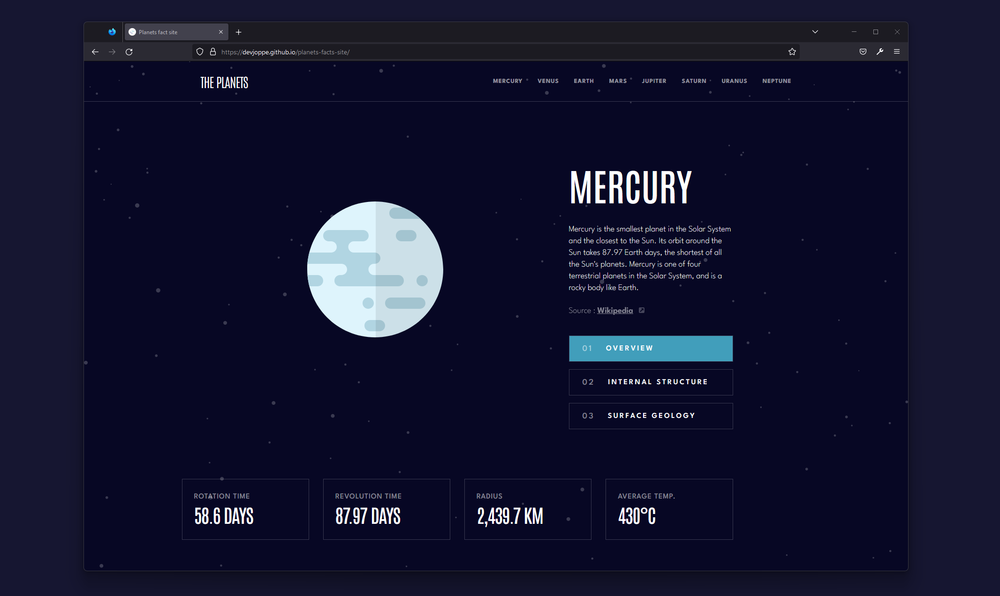

# Planets fact site

## Welcome! 👋

This is my solution to the [Planets fact site challenge on Frontend Mentor](https://www.frontendmentor.io/challenges/planets-fact-site-gazqN8w_f).🚀

### Solution URL

https://devjoppe.github.io/planets-facts-site/

## Overview

### The challenge

Users should be able to:

- View the optimal layout for the app depending on their device's screen size
- See hover states for all interactive elements on the page
- View each planet page and toggle between "Overview", "Internal Structure", and "Surface Geology"

### Screenshot

## My Process

- Semantic HTML5 markup
- JavaScript
- JSON
- SCSS